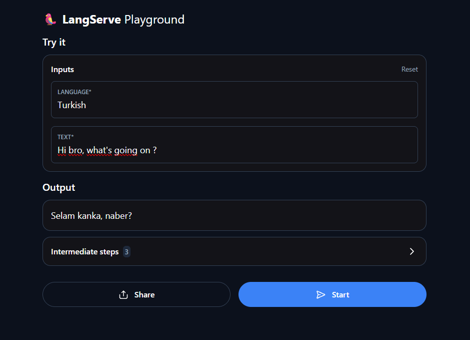

# LangChain Intro Project

Bu proje, LangChain'in temel kavramlarını Google Gemini modeliyle adım adım öğrenmek için hazırlanmış bir "Intro to LangChain" tutorial'ıdır. Mesaj gönderme, output parser kullanma, LCEL (LangChain Expression Language) ile chain oluşturma, prompt template'ler ve son olarak bu chain'i bir REST API olarak (LangServe ile) servis etmeyi kapsıyor.

## Gereksinimler

```
langchain
langchain-community
langchain-core
langchain-google-genai
langchain-text-splitters
python-dotenv
fastapi
langserve
sse_starlette
uvicorn
```

Kurulum:

```bash
pip install -r requirements.txt
```

## .env Yapılandırması

Proje kök dizinine bir `.env` dosyası oluşturun (`.env.example` şablon olarak kullanılabilir):

```env
# Google Gemini Yapılandırması
GEMINI_API_KEY="your-gemini-api-key-here"
GEMINI_MODEL_NAME="gemini-3.1-flash-lite"

# LangChain / LangSmith İzleme (opsiyonel; kapatmak için TRACING_V2=false)
LANGCHAIN_API_KEY="your-langsmith-api-key-here"
LANGCHAIN_TRACING_V2=true
LANGCHAIN_PROJECT="your-project-name"

# LangSmith hesabın hangi bölgedeyse ona göre ayarla:
# US (varsayılan): https://api.smith.langchain.com
# EU:              https://eu.api.smith.langchain.com
LANGCHAIN_ENDPOINT=https://eu.api.smith.langchain.com
```

> LangSmith izleme tamamen opsiyoneldir; sadece Gemini modelini kullanmak için gerekli değildir, `LANGCHAIN_TRACING_V2=false` yaparak kapatabilirsiniz.

## Dosyalar

Proje, tutorial'ı adım adım takip eden bağımsız script'lerden oluşuyor — her dosya bir öncekine yeni bir kavram ekliyor.

### `message.py`
En temel kullanım. `ChatGoogleGenerativeAI` modeline `SystemMessage` + `HumanMessage` listesi gönderip ham cevabı (`response.content`) ekrana basar.

### `messageWithOutputParser.py`
`StrOutputParser` eklenir. Modelin ham çıktısını (metadata içerebilen karmaşık formatı) sade bir string'e çevirir.

### `messageWithChainAndParser.py`
`model.invoke()` ve `parser.invoke()` çağrılarını LCEL'in `|` operatörüyle tek bir **chain**'e (`model | parser`) indirger.

### `messageWithTemplates.py`
Sabit mesajlar yerine `ChatPromptTemplate` kullanılır. `{language}` ve `{text}` gibi değişkenler `chain.invoke({...})` ile çalışma zamanında doldurulur. Chain artık `prompt_template | model | parser`.

### `serve.py`
Aynı chain, FastAPI + **LangServe** ile bir REST API olarak dışarı açılır. `uvicorn` ile sunucu ayağa kalkar, chain otomatik olarak `/chain` altında endpoint'lere dönüşür.

## Servisi Çalıştırma

```bash
python serve.py
```

Sunucu ayağa kalktıktan sonra:

| Adres | Açıklama |
|---|---|
| `http://localhost:8000/docs` | Otomatik oluşan Swagger/OpenAPI arayüzü |
| `http://localhost:8000/chain/playground` | LangServe'in hazır test arayüzü |
| `http://localhost:8000/chain/invoke` | Programatik POST isteği için endpoint |

Sunucuyu durdurmak için terminalde `Ctrl+C`, ya da IDE'nin Stop butonu kullanılabilir.

## Örnek Çalıştırma — LangServe Playground

`language: Turkish`, `text: "Hi bro, what's going on?"` girdisiyle test edilmiştir:



**Çıktı:** `Selam kanka, naber?`

### Intermediate Steps (Chain'in içinden geçen adımlar)

LangServe, chain'deki her Runnable'ın girdi/çıktısını ayrı ayrı gösterir — bu, `prompt_template | model | parser` zincirinin arka planda tam olarak neler yaptığını görmek için çok faydalıdır.

**1. `ChatPromptTemplate`** — girdi dict'ini (`language`, `text`) mesaj listesine dönüştürür:

```json
{
  "messages": [
    {
      "content": "Translate the following into Turkish:",
      "type": "system"
    },
    {
      "content": "Hi bro, what's going on ?",
      "type": "human"
    }
  ]
}
```

**2. `ChatGoogleGenerativeAI`** — mesajları Gemini'ye gönderir, ham `AIMessage` cevabını döner. Görüldüğü gibi Gemini'de içerik (`content`) düz string değil, `type: "text"` alanlı bir blok listesidir; ayrıca token kullanım bilgisi (`usage_metadata`) ve modelin kendi doğrulama imzası (`extras.signature`) de bu adımda görünür:

```json
{
  "generations": [[
    {
      "text": "Selam kanka, naber?",
      "message": {
        "content": [{ "type": "text", "text": "Selam kanka, naber?" }],
        "type": "AIMessageChunk",
        "usage_metadata": {
          "input_tokens": 16,
          "output_tokens": 8,
          "total_tokens": 24
        }
      }
    }
  ]]
}
```

**3. `StrOutputParser`** — bir önceki adımın karmaşık çıktısını sade bir string'e indirger:

```json
{
  "output": "Selam kanka, naber?"
}
```

Bu üç adım, `chain = prompt_template | model | parser` satırındaki `|` operatörünün pratikte ne yaptığını özetliyor: her Runnable'ın çıktısı, bir sonrakinin girdisi oluyor.
